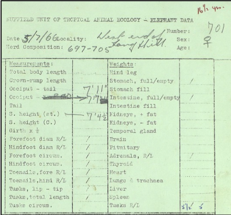

```{eval=FALSE, echo = FALSE}
Scroll bar issues:
https://stackoverflow.com/questions/21684101/css-vertical-scrollbar-padding-left-right-in-ul-possible
```

<style type="text/css">
body, td {
   font-size: 16px;
}
</style>

```{r, echo=FALSE}
library(knitr)
library(kableExtra)
```

# Investigating human-induced evolution in African elephants (Loxodonta africana)

Watch the HHMI BioInteractive video "Selection for Tuskless Elephants"

<iframe width="560" height="315" style="display: block; margin-left: auto; margin-right: auto;" src="https://www.youtube.com/embed/IxJDUrDH9v4" frameborder="0" allow="accelerometer; autoplay; encrypted-media; gyroscope; picture-in-picture" allowfullscreen></iframe>

<p></p>
After you watch the video, work with your partner to answer the following:

 1. How has the population of elephants changed over time?
    a. The size of the population:<br><br>
    b. Phenotypic changes in the population:<br><br>
   
 2. What has driven the changes in the population of elephants?
 
 3. Given the changes in the population, do you think tusklessness is a heritable trait?  Explain your reasoning.
 
```{r, echo=FALSE}
table1 <- data.frame(Sex = c("Male", "Female"), 
                     N = c(54, 81), Tuskless = c(0, 41), "Perc. Tuskless" = c("0%", "51%"))
kable(table1,
      align = "c",
      col.names = c("Sex",
                    "N",
                    "Tuskless",
                    "% Tuskless"),
      caption = "Table 1. Tusklessness in the registered elephants in Gorongosa National park, Mozambique.") %>%
  kable_styling("bordered", full_width = F, position = "float_right") %>%
  row_spec(0, background = "#EEE") %>%
  row_spec(1:2, background = "white")
```
 
 4. The table to the right summarizes a recent census of the Gorongosa elephants by Dr. Joyce Poole.
    a. Is tusklessness more common in male or female elephants?<br><br>
    b. Is there an advantage to having tusks?<br><br>
    c. What is the potential disadvantage to having tusks?<br><br>
    d. Are the advantages/disadvantages the same or asymmetric in males and females? Explain.<br><br>
    e. Provide a hypothesis to explain the pattern observed in Table 1 using on your answers above.<br><br>
    
 5. If you were to go back to this population in 100 years, predict how frequent tusklessness would be if...
    a. there was no poaching...<br><br>
    b. there was another extreme poaching event...
    
 &emsp;&emsp;Justify your reasoning.
 
## How have other African elephant populations changed in response to poaching?

<div style="float: right; width: 300px; margin-left: 10px;">
<br>
<span style="float: right">Figure 1. Photo from tusk harvest in the 1880s (Robert H Milligan, New York Public Library)</span>
</div>
As Joyce Poole mentioned, there are many other populations of elephants on the African continent and they may have also experienced similar selective pressures due to poaching as the populations in Gorongosa.To further investigate these effects, we will examine data comparing historical and contemporary populations of elephants along the Kenya-Tanzania border. The populations in Kenya and Tanzania are among the largest on the African continent, according to a recent census by Chase et al. (2016) (Table 2). Similar to the Gorogosa populations, these populations have experienced poaching and have suffered recent population declines (Chase et al. 2016).<br><br>
```{r, echo=FALSE}
table2 <- data.frame(Country = c("Angola", "Botswana", "Cameroon", "Chad", "DR Congo", "Ethiopia", "Kenya", "Malawi", "Mali", "Mozambique", "South Africa", "Tanzania", "Uganda", "W. Africa", "Zambia", "Zimbabwe", "TOTAL"), 
                     Elephants = c(3395, 130451, 148, 743, 1959, 799, 25959, 817, 253, 9605, 17433, 42871, 4864, 8911, 21759, 82304, 352271),
                     SE = c(797, 6378, 84, 0, 150, 0, 1805, 0, 0, 1018, 0, 3102, 1031, 1299, 2310, 4382, 9085),
                     `95% CI` = c("1,778-5,012", "116,957-142,043", "12-313", "", "1,773-2,254", "", "22,421-29,497", "", "", "7,610-11,600", "", "36,792-48,950", "2,843-6,885", "6,366-11,457", "17,232-26,286", "73,715-90,893", "334,464-370,078"))
kable(table2,
      align = "l",
      col.names = c("Country",
                    "Elephants",
                    "SE",
                    "95% CI"),
      caption = "Table 2. Estimated elephant populations from the Great Elephant Census (GEC)",
      format.args = list(big.mark = ",")) %>%
  kable_styling("bordered", full_width = F, position = "float_left") %>%
  row_spec(0, background = "#EEE") %>%
  row_spec(17, bold = T) %>%
  row_spec(1:17, background = "white")
```
<br><br><br><br>
Chiyo et al. (2015) investigated changes in populations of Loxodonta africana located along the Kenya-Tanzania border between the 1960s and the 2000s.    Rather than observing tusklessness like Dr. Poole, Chiyo et al. (2015) examined evidence of subtler changes in tusk morphology over time due to poaching.  They used Historical records to collect height (estimated to the shoulder), tusk length, and tusk circumference from approximately 600 elephants that were culled in Tsavo East National Park (Kenya) and Mkomazi National Park (Tanzania) between 1966 and 1968.  Figure 2 is an example of the historical records used in the study (for more information see: http://ufdc.ufl.edu/AA00013409/00007).  Contemporary data were collected from live animals that were translocated from southern Kenya to Tsavo East National Park (2005), Masai Mara National Reserve (2011), and Meru National Park (2013).<br><br>
<div style="float: right; width: 400px; margin-left: 10px; margin-top: 10px;">
<br>
<span style="float: right">Figure 2. Example of historical records of elephant morphology used by Chiyo <emph>et al.</emph> (2015)</span>
</div>
<div style="clear:both;"></div><br>
 6. Given what you have learned about the long-term impacts of poaching on elephant populations, generate a prediction about changes in tusk size from the 1960s population to the 2010s population.<br><br>
 I expect that the elephants in the 1960s had **larger**/**smaller** (*choose one*) tusks compared to elephants measured in the 2000 because ____________________

## References

Chase, M. J., S. Schlossberg, C. R. Griffin, P. J. C. Bouché, S. W. Djene, P. W. Elkan, S. Ferriera, F. Grossman, E. M. Kohi, K. Landen, P. Omondi, A. Peltier, S. A. F. Selier, and R. Sutcliffe.  2016. Continent-wide survey reveals massive decline in Africa savannah elephants.  PeerJ, 4:e2354. [doi: 10.7717/peerj.2354](https://doi.org/10.7717/peerj.2354)

Chiyo, P. I., V. Obanda, and D. K. Korir. 2015. Illegal tusk harvest and the decline of tusk size in the African elephant.  Ecology and Evolution, 5 (22): 5216-5229. [doi: 10.1002/ece3.1769](https://doi.org/10.1002/ece3.1769)

Chiyo PI, Obanda V, Korir DK. 2015. Data from: Illegal tusk harvest and the decline of tusk size in the African elephant. Dryad Digital Repository. [doi: 10.5061/dryad.h6t7j](https://doi.org/10.5061/dryad.h6t7j)
