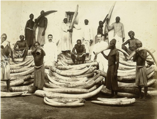

<style type="text/css">
body, td {
   font-size: 16px;
}
</style>

```{r, echo=FALSE}
library(knitr)
library(kableExtra)
```

# Investigating human-induced evolution in African elephants (Loxodonta africana)

Watch the HHMI BioInteractive video "Selection for Tuskless Elephants"

<iframe width="560" height="315" style="display: block; margin-left: auto; margin-right: auto;" src="https://www.youtube.com/embed/IxJDUrDH9v4" frameborder="0" allow="accelerometer; autoplay; encrypted-media; gyroscope; picture-in-picture" allowfullscreen></iframe>

<p></p>
After you watch the video, work with your partner to answer the following:

 1. How has the population elephantschanged over time?
    a. The size of the population:<br><br>
    b. Phenotypic changes in the population:<br><br>
   
 2. What has driven the changes in the population of elephants?
 
 3. Given the changes in the population, do you think tusklessness is a heritable trait?  Explain your reasoning.
 
 ```{r, echo=FALSE}
 table1 <- data.frame(Sex = c("Male", "Female"), 
 N = c(54, 81), Tuskless = c(0, 41), "Perc. Tuskless" = c("0%", "51%"))
 kable(table1,
       align = "c",
       col.names = c("Sex",
                     "N",
                     "Tuskless",
                     "% Tuskless"),
       caption = "Table 1. Tusklessness in the registered elephants in Gorongosa National park, Mozambique.") %>%
  kable_styling(bootstrap_options = "striped", full_width = F, position = "float_right")
 ```
 
 4. The table to the right summarizes a recent census of the Gorongosa elephants by Dr. Joyce Poole.
    a. Is tusklessness more common in male or female elephants?<br><br>
    b. Is there an advantage to having tusks?<br><br>
    c. What is the potential disadvantage to having tusks?<br><br>
    d. Are the advantages/disadvantages the same or asymmetric in males and females? Explain.<br><br>
    e. Provide a hypothesis to explain the pattern observed in Table 1 using on your answers above.<br><br>
    
 5. If you were to go back to this population in 100 years, predict how frequent tusklessness would be if...
    a. there was no poaching...<br><br>
    b. there was another extreme poaching event...
    
 &emsp;&emsp;Justify your reasoning.
 
## How have other African elephant populations changed in response to poaching?

<div style="float: right; width: 300px; margin-left: 10px;">
<br>
<span style="float: right">Figure 1. Photo from tusk harvest in the 1880s (Robert H Milligan, New York Public Library)</span>
</div>
As Joyce Poole mentioned, there are many other populations of elephants on the African continent and they may have also experienced similar selective pressures due to poaching as the populations in Gorongosa.To further investigate these effects, we will examine data comparing historical and contemporary populations of elephants along the Kenya-Tanzania border. The populations in Kenya and Tanzania are among the largest on the African continent, according to a recent census by Chase et al. (2016) (Table 2). Similar to the Gorogosa populations, these populations have experienced poaching and have suffered recent population declines (Chase et al. 2016).

